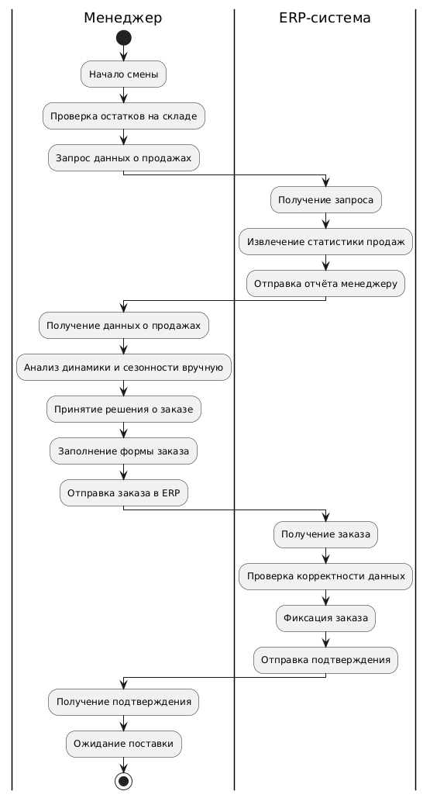

# Проектное задание: командное проектирование информационной системы с ИИ-начинкой

## Кейс 3
**Бизнес-цель:** Оптимизировать управление товарными запасами и логистикой путем точного прогнозирования спроса на товары в каждой точке продаж сети супермаркетов.

**Описание текущего процесса:**

Сейчас заказы товаров формируются вручную на основе интуиции менеджеров → частые ошибки (избыток/дефицит) ведут к потерям из-за просроченных товаров (молоко, хлеб) или упущенной выручки при отсутствии товара (спрос есть, продавать нечего).

Руководство сети хочет автоматизировать процесс управления запасами и логистикой, чтобы уменьшить ошибки и увеличить выручку. В качестве данных предполагается использование накопленной статистики по продажам каждого товара в каждом магазине за последний год.

Количество уникальных товаров в сети - 10_000. Количество магазинов - 500. Количество продаж за последний год по всей сети - 2_670_000_000

## Состав команды
1. Александр Захарчук К3341 — Владелец продукта, Архитектор данных
2. Ярослав Сахно К3341 — Дата-аналитик, Архитектор системы

## Отчет
### Бизнес-процессы
#### До

#### После

#### Разница
Разрабатываемая информационная система с использованием машинного обучения значительно трансформирует бизнес-процессы управления товарными запасами в сети супермаркетов. Ранее заказы формировались вручную на основе интуиции менеджеров, что часто приводило к ошибкам, избыточным или недостаточным запасам. После внедрения системы прогноз спроса будет автоматически формироваться на основе анализа исторических данных о продажах, сезонности, погодных условий и других факторов. Это позволит повысить точность заказов, сократить количество списаний и упущенной выручки, снизить трудозатраты менеджеров, а также ускорить процесс принятия решений. ERP-система из простого регистратора заказов превращается в полноценный источник данных и участника автоматизированного обмена информацией. Менеджер при этом переходит от ручного прогнозирования к роли контролёра и корректировщика рекомендаций, что снижает влияние человеческого фактора и повышает устойчивость бизнес-процесса в целом.
### Диаграмма структуры данных

Сущности:
* Store — магазин, уникальный по store_id.
* Product — товар с категориальными характеристиками.
* Sales — исторические продажи (ключевая таблица для ML).
* Forecast — предсказания спроса по товарам в магазинах.
* Inventory — текущее состояние склада (можно использовать как фичу и как выход для обратной связи).
### Диаграмма архитектуры системы

* WMS = warehouse management system
* POS = point of sail
* ERP = enterprise resource planning
* ETL = extract, transform, load
* ELT = extract, load, transform

Краткое описание компонентов:
* ERP / WMS / POS — внешние источники.
* Сбор данных и ETL — передают и трансформируют информацию.
* Feature Store и ML-модель — основа ML-системы.
* Forecast API — интерфейс доступа к прогнозам.
* Dashboard — визуализация результатов для бизнеса.
* Хранилища — логическое разделение для данных.

#### Deployment

### Структурная UML-диаграмма
#### Диаграмма компонентов 

#### Диаграмма классов

### Поведенческая UML-диаграмма 
#### Диаграмма активностей

#### Диаграмма прецедентов

#### Диаграмма последовательностей

## Ответы на вопросы
## 1. Цели и предпосылки  

| Вопрос | Ответ |
|-------|-------|
| **Зачем идём в разработку продукта?** | • Снизить потери от списаний скоропортящихся товаров (молоко, хлеб, ready‑to‑eat). • Повысить on‑shelf availability, чтобы не терять выручку из‑за out‑of‑stock. • Сократить ручную рутину категорийных менеджеров и освободить до 30 % их времени. |
| **Почему станет лучше, чем сейчас, от использования ML?** | ML‑прогноз **учитывает десятки факторов одновременно** (дни недели, акции, праздники, погоду, тренды, кросс‑каннибализацию), а человек держит в голове 3‑4.  • ▼ MAE прогноза спроса на 40‑50 % → меньше списаний. • ▲ Fill‑Rate до 97‑98 % → рост LFL‑выручки на 2‑4 %. |
| **Бизнес‑требования и ограничения** | • Критичные категории — скоропорт (±2 дня) • Горизонт прогноза — 1–14 дней вперёд. • Автоматический заказ не должен превышать вместимость складской зоны. • Срок вывода MVP — ≤ 4 месяцев; CAPEX ≤ €300 k. |
| **Функциональные требования** | 1. Суточный прогноз спроса **для каждой пары “магазин–SKU”**. 2. API, отдающее рекомендованный объём заказа и доверительный интервал. 3. Виджет в ERP для менеджера с возможностью правки и подтверждения. 4. Мониторинг MAE/SMAPE, алерты при деградации. |
| **Нефункциональные требования** | • SLA API ≥ 99.9 %, p95 latency < 200 ms. • Поддержка 10k SKU × 500 магазинов ≈ 5 млн записей/день. • Секретность данных персонала и поставщиков (GDPR, ISO‑27001). |
| **Как построить процесс пилота?** | 1. Отобрать 15 магазинов (5 флагманов, 10 средних). 2. Категории — молоко, хлеб, фрукты (≈ 300 SKU). 3. Период обучения — 12 мес исторических данных; пилотный run — 8 недель. 4. A/B: 50 % магазинов — ML, 50 % — ручной заказ. 5. Собираем метрики ежедневно, сравниваем по paired t‑test. |
| **Критерии успеха пилота** | • Снижение списаний (€/SKU) ≥ 15 %. • Сокращение out‑of‑stock ≥ 20 %. • Доля заказов, принятых без правок менеджера ≥ 70 %. • Положительный unit‑экономический эффект (ROI ≥ 1 в 12 мес). |
| **Что войдёт в MVP, а что — технический долг** | **MVP**: базовая ETL; градиентный бустинг + simple LSTM ансамбль; дневной запуск; REST API; дешборд Grafana. **Техдолг**: авто‑ML retraining, онлайн‑featurization (погода), оптимизатор цепочки поставок, MLOps‑каталог Feast, запасы DC‑→‑Store. |

## 2. Методология  

| Вопрос | Ответ |
|-------|-------|
| **Что делаем с технической точки зрения?** | Основная задача — **мультирегрессионный прогноз временных рядов** (per‑SKU‑per‑Store).  Компоненты:  • LightGBM / CatBoost с feature engineering для одно‑дневного горизонта. • Seq2Seq (LSTM/TFT) для 1–14 дней. • Встроенный anomaly detector (IsolationForest) для выбросов в данных. |
| **Какие данные нужны?** | • Чеки продаж (SKU, qty, price, promo). • Остатки на складах. • Календарь праздников / pay‑days. • Акции и ценовые механики. • SKU‑метаданные (категория, срок годности). **Критично** иметь: дату, SKU‑id, Store‑id, qty, on‑hand. Без остатков невозможно сформировать заказ. |
| **Метрики ML и связь с бизнесом** | • **MAE/SMAPE** → напрямую коррелирует со списаниями. • **P90‑Stock‑out Rate** → отражает потери выручки. • **Weighted MAPE (by revenue)** → важнее популярные товары. • Конвертируем в € через себестоимость утиля и маржу. |
| **Риски анализа и моделирования** | 1. Неточные остатки → занижен/завышен заказ. 2. Concept drift (COVID‑like). 3. Нерегулярные промо‑кампании. **Митигируем**: регулярный data‑quality dashboard, ежедневный drift‑score, резервная safety‑factor формула. |

## 3. Подготовка и оценка пилота  

1. **Data readiness‑чек**: completeness ≥ 98 %, латентность выгрузки < 2 часов.  
2. **Baseline**: простая экспоненциальная сглаженная средняя + safety stock.  
3. **Валидация**: rolling‑origin backtesting, horizon = 14 дней, step = 1.  
4. **Track‑метрики ежедневно**; автоматический репорт в Slack.  
5. **Success** — критерии из таблицы 1.

## 4. Внедрение production‑системы  

| Компонент | Назначение | Технология/Стек |
|-----------|-----------|-----------------|
| **Data Lake** | хранение сырых логов чеков/складов | S3 / HDFS |
| **ETL/ELT** | очистка, агрегирование, вакуум | Apache Spark + Airflow |
| **Feature Store** | versioned features для онлайн/офлайн | Feast (+ Redis online) |
| **Model Training** | off‑line генерация моделей | MLflow + Docker + GPU‑nodes |
| **Model Serving** | REST gRPC сервис прогнозов | FastAPI + TorchServe |
| **Order Engine** | business‑rules + оптимизатор вместимости | Python (OR‑Tools) |
| **Monitoring** | latency, MAE, drift, infra | Prometheus + Grafana + Alertmanager |
| **User UI** | виджет “рекоменд‑заказ” в ERP | iframe / React micro‑frontend |

#### Инфраструктура и масштабируемость  
* **Kubernetes‑кластер** (on‑prem + autoscaling в облаке) — быстро масштабируем под пиковые расчёты (—> Spark jobs).  
* **Плюсы**: неизменяемые образы, blue‑green для моделей, горизонтальное масштабирование API.  
* **Минусы**: DevOps‑сложность, нужен observability‑стек.

#### Требования к работе  
* **SLA** 99.9 % (down‑time ≤ 43 мин/мес).  
* **RPS**: 1500 req/min ночью (bulk), 50 req/min днём.  
* **p95 latency**: < 200 ms на 1 запрос, < 15 мин на полный ночной прогон.

#### Ключевые риски и неопределённости  
| Риск | Вероятность | Влияние | План |
|------|-------------|---------|------|
| Неконсистентные остатки | Сред | Высокое | сверка ERP vs WMS, ежедневный баланс net‑stock |
| Concept Drift | Низк/Сред | Сред | еженедельный retrain, A/B shadow‑deploy |
| Сопротивление пользователей | Сред | Сред | UX‑тренинги, режим “рекомендация” без авто‑проводки первые 4 недели |
| Инфраструктурные сбои | Низк | Высокое | резервный план: rule‑based EOQ‑алгоритм |